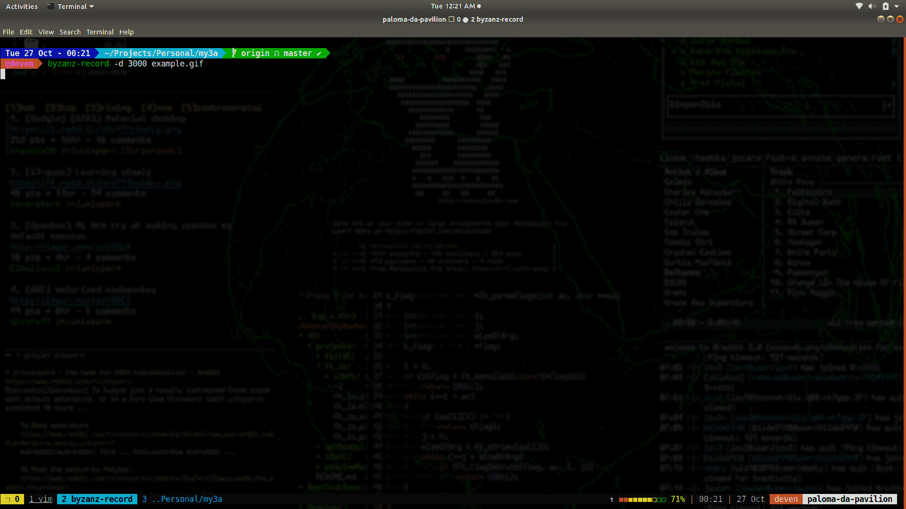

<p align="center"></p>

<div align="center">
  <a href="https://travis-ci.com/deven96/mythra">
    
  </a>
</div>

# Mythra

In my bid to learn rust I am trying to make a music web scraper


In order to use either the `ncurses` or the `pancurses` backend of a dependent library `cursive`, you will need the ncurses library installed on your system.

## Archlinux

```
pacman -S ncurses
```

## Ubuntu

```
apt-get install libncursesw5-dev
```

## Fedora

```
yum install ncurses-devel
```

## macOS

```
brew install ncurses
```

### Engines

- Mp3Red


## Installation
With Rust installed

You must have [chromedriver](https://chromedriver.chromium.org/) available on path and running on port 4444

```bash
git clone https://github.com/deven96/mythra.git
chromedriver --port=4444 --headless

# develop

cargo update
cargo run

#run the pakage
./target/release/mythra search --query "Justin Timberlake Mirrors"

```
Or download from Github [Releases](https://github.com/deven96/mythra/releases)

## Example

<p align="center"></p>

## Deployment

The deployed API version from `mythra api` is available on [Heroku]([200~https://bisoncorps.stoplight.io/docs/mythra/reference/Mythra.v1.yaml). Please read the API documentation for usage

## License

This project is opened under the [GNU AGPLv3](https://github.com/deven96/mythra/blob/master/LICENSE) which allows very broad use for both academic and commercial purposes.


## Credits
Library/Resource | Use
------- | -----
[Stoplight](https://stoplight.io) | Generating API docs
[Fantoccini](https://github.com/jonhoo/fantoccini/) | Scraping javascript sites using chromedriver/geckodriver
